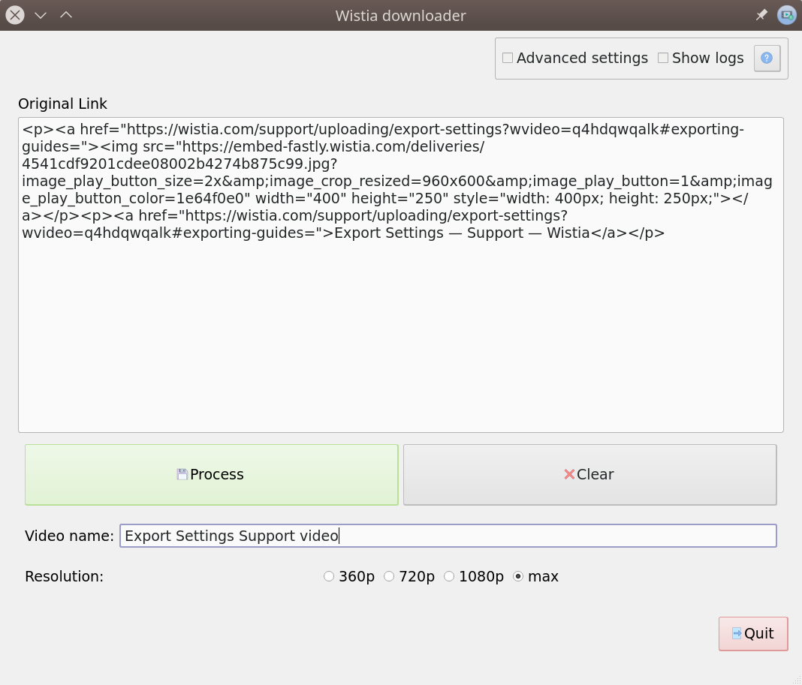

# Wistia Gui Downloader

A simple tool to download Wistia videos:



## How to Install

The latest release can be downloaded from the link below (no installation needed):

[https://github.com/salaheddinek/wistia-gui-downloader/releases/latest](https://github.com/salaheddinek/wistia-gui-downloader/releases/latest)

Otherwise, The user can build the application using files in ```bundle``` folder:


## How to use

Download wistia videos using videoplayer links:

Follow these steps:

1. Right click on video.
2. Click 'copy link and thumbnail'.
3. Past it to link entry.
4. Click on **process** button and wait for video to download.

## Example

An example of a Wistia video can be found in the following link:

[https://wistia.com/support/uploading/export-settings#exporting-guides=](https://wistia.com/support/uploading/export-settings#exporting-guides=)

